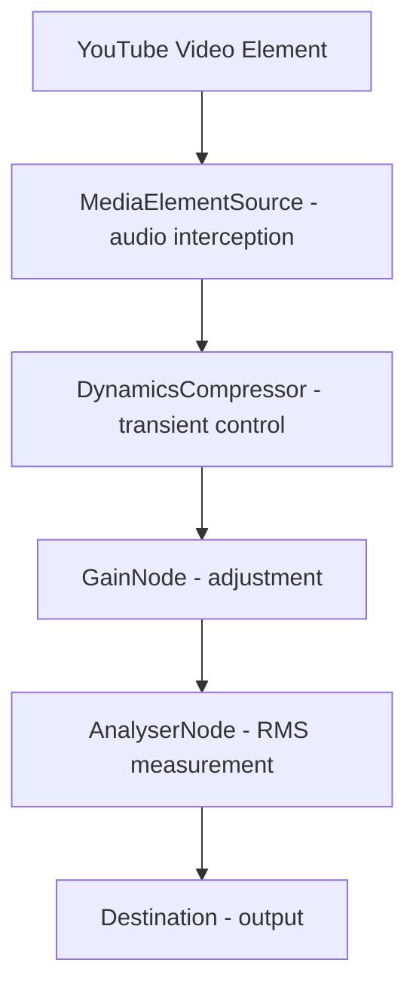
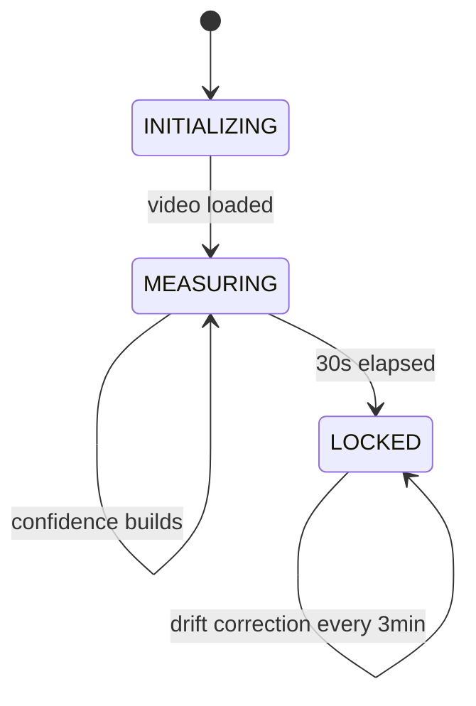

# Contributing to YT Levelr

YT Levelr is a small solo project that welcomes contributions. The guidelines below are written with that context in mind.

## Project Structure

```text
yt-levelr/
├── yt-levelr/              # Extension source files
│   ├── manifest.json       # Extension manifest (Manifest V3)
│   ├── content.js          # Main audio processing logic
│   ├── popup.html          # Extension popup UI
│   ├── popup.js            # Popup functionality and state management
│   └── icons/              # Extension icon files
├── privacy.html            # Privacy policy
├── README.md               # User documentation
├── CHANGELOG.md            # Version history
├── package.json            # Dev tooling dependencies
├── eslint.config.mjs       # ESLint configuration
├── .github/
│   └── workflows/
│       └── release.yml     # CI/CD release automation
├── .vscode/
│   ├── settings.json       # VS Code configuration
│   └── tasks.json          # Build tasks
├── .gitignore              # Git ignore rules
├── screenshot.png          # Extension screenshot
└── reviewer-notes.md       # Technical implementation notes
```

## Development Setup

### Prerequisites

- **Git**: For version control
- **Node.js**: For linting and formatting tools
- **Firefox or Chrome**: For testing the extension

### Loading for Development

**Firefox:**

1. Navigate to `about:debugging`
2. Click "This Temporary Add-on"
3. Click "Load Add-on from File..."
4. Select the `yt-levelr/yt-levelr` folder

**Chrome:**

1. Navigate to `chrome://extensions`
2. Enable "Developer mode"
3. Click "Load unpacked"
4. Select the `yt-levelr/yt-levelr` folder

### Building

The extension requires no build step - source files are packaged directly.

To create a zip for distribution:

```powershell
Compress-Archive -Path yt-levelr/* -DestinationPath build/yt-levelr.zip -Force
```

## Code Style

### JavaScript

- **Indentation**: 2 spaces (configured in `.editorconfig`)
- **Line Length**: Maximum 120 characters
- **Semicolons**: Required
- **Braces**: Always use braces for control structures
- **Naming**: camelCase for variables/functions, PascalCase for classes

To auto-fix and format, run from the project root:

```bash
npx eslint --fix yt-levelr/content.js yt-levelr/popup.js
npx prettier --write yt-levelr/content.js yt-levelr/popup.js
```

### HTML/CSS

- **Indentation**: 2 spaces
- **Class Naming**: BEM-style naming convention preferred
- **CSS Variables**: Use CSS custom properties for theming

### JSON

- **Indentation**: 2 spaces
- **Key Ordering**: Group related keys together
- **Trailing Commas**: Allowed (modern parsers support this)

## Code Quality

### Error Handling

Always wrap critical operations in try-catch blocks:

```javascript
try {
  // Critical operation
  audioCtx.resume();
} catch (err) {
  console.warn("[YT Levelr] Failed to resume AudioContext:", err);
}
```

### Logging

Use consistent logging patterns:

```javascript
function log(msg) {
  console.debug("[YT Levelr]", msg);
}

function error(msg, err) {
  console.error(`[YT Levelr] ${msg}:`, err);
}
```

### Performance

- **Debouncing**: Use debouncing for frequent operations (e.g., polling)
- **Rate Limiting**: Limit measurement updates to avoid excessive processing
- **Memory Management**: Clean up intervals and listeners on tab close

## Testing

### Manual Testing Checklist

- [ ] Navigate to various YouTube videos (podcasts, interviews, etc.)
- [ ] Verify gain adjustment works correctly
- [ ] Check popup displays accurate information
- [ ] Test edge cases: muted video, paused video, very quiet content
- [ ] Verify extension survives browser restart
- [ ] Test on different screen sizes
- [ ] Verify privacy policy is accessible

### Browser Compatibility

Test on:
- Firefox (primary platform)
- Chrome
- Edge (Chromium-based)

## Known Limitations

1. **Music Videos**: Extended quiet intros may not be handled correctly
2. **Very Quiet Audio**: Content below -48 dBFS may not trigger measurements
3. **YouTube Changes**: May break on major YouTube UI redesigns

## Pull Request Guidelines

### Before Submitting

1. Update README and CHANGELOG if needed
2. Test on Firefox and Chrome
3. Run ESLint and Prettier (see Code Style above)
4. Use clear, descriptive commit messages

### Commit Message Format

```
<type>(<scope>): <subject>

<body>

<footer>
```

**Types:** `feat`, `fix`, `docs`, `style`, `refactor`, `perf`, `test`, `chore`

**Examples:**

```
feat(popup): add target level slider with persistence
fix(content): handle AudioContext suspension gracefully
docs(README): add troubleshooting section for common issues
```

## Architecture Overview

### Audio Processing Pipeline



### State Machine



### Message Protocol

Popup to content script communication:

| Type | Direction | Purpose |
|------|-----------|---------|
| `getState` | popup → content | Request current state |
| `setState` | popup → content | Enable/disable extension |
| `setTarget` | popup → content | Update target RMS level |
| `remeasure` | popup → content | Reset measurement for current video |

---

**Maintained by**: APMicro
**Repository**: https://github.com/AndyP2/yt-levelr
