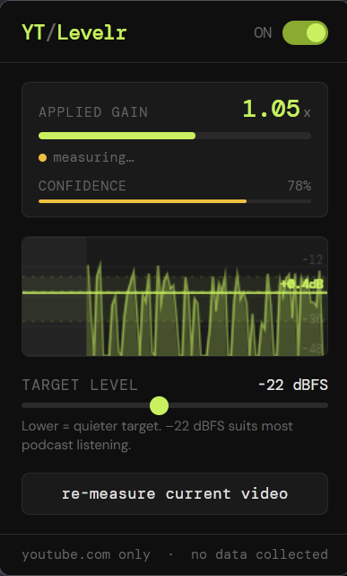
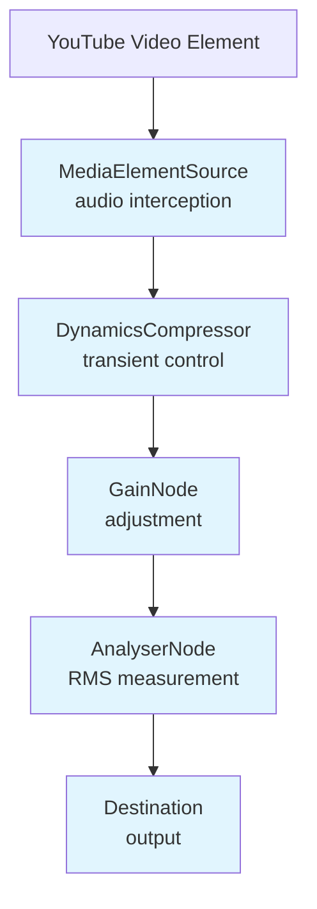

# YT Levelr

A Firefox and Chrome extension that automatically equalizes the volume of YouTube videos, especially podcasts where every producer has their own idea of what the correct levels should be.

## Features

- **Automatic Loudness Normalization**: Automatically adjusts audio levels between videos to create a consistent listening experience
- **Smart Gain Management**: Uses asymmetric gain limits (more aggressive cuts than boosts) to prevent sudden loud blasts
- **Confidence-Based Adjustment**: Gradually widens gain range over 30 seconds as confidence in measurement grows
- **Drift Correction**: Slow automatic correction every 3 minutes after lock to handle long-term level shifts
- **Noise Floor Protection**: Ignores silence periods to avoid skewing measurements
- **Local Processing Only**: All audio processing happens entirely within your browser - no data is collected or transmitted
- **Cross Browser Support**: uses Manifest V3 for compatibility with chrome/edge/comet and firefox

## Installation

### Firefox

Install from the official [Firefox Add-on Store](https://addons.mozilla.org/en-GB/firefox/addon/yt-levelr).

### Chrome

Install from the official [Chrome Web Store](https://chromewebstore.google.com/detail/yt-levelr/ikoamkjhfcmpcajnbfaldhmjgjbmfjgj).

To install manually:

1. Download and unzip the latest release from [GitHub Releases](https://github.com/AndyP2/yt-levelr/releases)
2. Go to `chrome://extensions/`, enable Developer mode
3. Click "Load unpacked" and select the unzipped folder

## How It Works

YT Levelr uses the Web Audio API to intercept audio output from YouTube's video element and applies automatic gain correction:

1. **Audio Interception**: Creates a source node from YouTube's video element
2. **RMS Measurement**: Continuously measures Root Mean Square (RMS) amplitude of the audio
3. **Gain Calculation**: Compares measured level against your target level (default: -22 dBFS)
4. **Smooth Transitions**: Applies gain changes with asymmetric attack/release times to protect against sudden loud sounds
5. **Locking**: After 30 seconds, gain locks and only drift correction applies

### Strategy Details

- **Gain Limits Widen Over Time**:
  - 0s: ±6dB/+3dB (immediate, low confidence)
  - 10s: ±12dB/+6dB
  - 30s+: ±20dB/+15dB (full range, locked)

- **Asymmetric Treatment**: Cuts are permitted more aggressively than boosts because a sudden loud blast is worse than staying quiet for a few seconds

- **Gain Transitions**: Faster transitions for cuts (0.15s) than boosts (1.2s) to protect against sudden loud audio

## Usage

1. Install the extension
2. Reload any open YouTube tabs
3. Play a video - the extension starts measuring immediately
4. Click the icon to adjust target level (-30 to -12 dBFS recommended)
5. After 30 seconds, gain locks for consistent levels

### Re-measuring

Click "re-measure current video" in the popup if:

- The extension locked at an incorrect level
- You want a fresh measurement with new settings

## Visual Indicators

The popup displays real-time information:

- **Applied Gain**: Current gain multiplier being applied
- **Status**: Shows measuring, locked, or disabled state
- **Confidence Bar**: Progress toward full confidence (100% at 30s)
- **Waveform Display**: Visual representation of audio levels with target line

## Limitations

### Optimized Content Types

- ✅ **Podcasts**: Primary use case - spoken word content works excellently
- ✅ **Interviews**: Conversational audio normalizes well
- ✅ **Audiobooks**: Consistent narration levels handled correctly
- ✅ **Lectures**: Educational content with steady delivery

### Known Limitations

- ⚠️ **Music Videos**: Extended quiet intros may not be handled correctly due to the confidence-based approach
- ⚠️ **Dynamic Range Content**: Music with extreme dynamic range may benefit from manual adjustment
- ⚠️ **Very Quiet Audio**: Content consistently below -48 dBFS may not trigger measurements

### Browser Compatibility

- **Firefox**: Fully supported (tested on Firefox 150.3)
- **Chrome**: Fully supported (tested on Chrome 148)
- **Comet**: Fully supported (tested on Comet 147)
  - install from the chrome web store when available
- **Edge** (and other chromium-based browsers): Not tested, should work

## Privacy

YT Levelr is privacy-first:

- ✅ No data collection or transmission
- ✅ All processing happens locally in your browser
- ✅ Only stores `enabled` and `targetDB` preferences locally
See [Privacy Policy](privacy.html) for complete details.

## Technical Details

### Architecture

### Audio Processing Pipeline

1. **Input**: Captures audio from YouTube's video element
2. **Compression**: Gentle dynamics compression to tame transient peaks
3. **Gain Adjustment**: Applies calculated gain based on RMS measurement
4. **Analysis**: Continuously measures output level for feedback
5. **Output**: Delivers normalized audio to speakers

### State Management

- **Measurement Phase** (0-30s): Actively measuring and adjusting gain within confidence limits
- **Locked Phase** (30s+): Gain locked, only drift correction applies
- **Drift Correction**: Every 3 minutes after lock, blends 10% toward new target based on recent measurements

### Storage

The extension stores only two user preferences locally:

- `enabled`: Whether the extension is active
- `targetDB`: Your chosen target loudness level in dBFS

These values never leave your browser.

## Contributing

Contributions welcome! See the [GitHub repository](https://github.com/AndyP2/yt-levelr) for:

- Issue tracking
- Feature requests
- Pull requests
- Development guidelines

## License

YT Levelr is open source. See the GitHub repository for licensing details.

## Support

- **Issues**: [GitHub Issues](https://github.com/AndyP2/yt-levelr/issues)
- **Documentation**: See README, privacy policy, and reviewer notes
- **Questions**: Open an issue or pull request on GitHub

---
**Homepage**: https://github.com/AndyP2/yt-levelr
